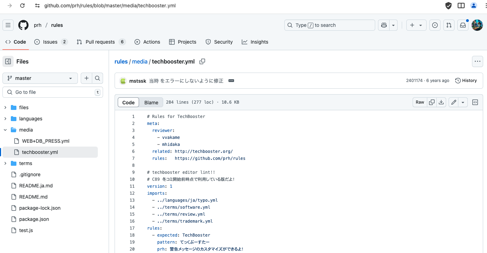
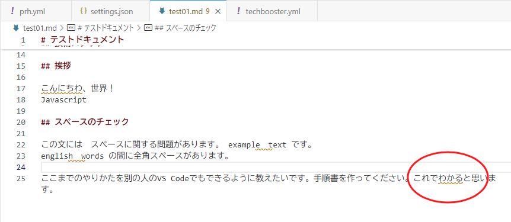

# PRH：技術書典ルールのインストール


## 技術書典の執筆に役立つルール

- 「TechBooster」という技術同人誌の執筆コミュニティ向けのルールが元になっているようですが、一般的な技術文書にも応用できる部分が多く含まれています。表記ルールを prh でチェックするための設定ファイルです。

https://github.com/prh/rules/blob/master/media/techbooster.yml





このファイルは大きく分けて以下のセクションで構成されています。

#### meta: ファイル自体のメタ情報です。

- reviewer: このルールセットのレビュー担当者。
- related: TechBoosterの公式サイトへのリンク。
- rules: このルールセットが属する prh/rules リポジトリへのリンク。

#### version: prh のルールフォーマットのバージョンを指定します。ここでは 1 です。

#### imports: 他のルールファイルを読み込んでいます。これにより、基本的なタイポ修正や用語統一のルールを共通化できます。

- ../languages/ja/typo.yml: 日本語の一般的なタイポ（誤字脱字）に関するルール。
- ../terms/software.yml: ソフトウェア関連の用語に関するルール。
- ../terms/review.yml: レビューや校正に関連する用語のルール。
- ../terms/trademark.yml: 商標に関する表記ルール。 これらのインポートにより、このファイルではTechBooster固有のルールに集中できます。 
#### rules: ここに個別の表記ルールが定義されています。主なルールの種類と具体例を解説します。

- prh/rules リポジトリ自体が、ユーザーが利用できる「公式のルール集」という位置づけに近いものです。


## Markdownの執筆に役立つルール

- techbooster.yml とは目的が少し異なります。techbooster.yml が具体的な表記揺れを修正するための「ルール」を定義していたのに対し、この markdown.yml は、Markdownファイル内の特定の箇所を prh のチェック対象から「除外」するための設定を定義しています。

つまり、ここに書かれたパターンに一致する部分は、他のルールファイル（例えば techbooster.yml やインポートされる typo.yml など）によるチェックが行われなくなります。これは、Markdownの構文要素（リンクURLやコードブロックなど）が、通常の文章校正ルールによって誤って修正されてしまうのを防ぐために非常に重要です。

https://github.com/prh/rules/blob/master/files/markdown.yml

```markdown
version: 1

# Markdown 形式に対する除外設定
# 可能であればmapfileなどを組み合わせ、map先のファイル側を校正するようにしたい

targets:
  - file: /\.md$/ # この設定が適用されるファイルを指定
    excludes:
      # [説明](http://example.com) 的なやつを除外  系も弾ける
      # TODO 肯定的後読みが使えるようになったら [説明] 部分が対象に含まれないようにする
      - pattern: /\[[^\]]*\]\([^)]+\)/
      # コードブロック内部をチェックしないようにする
      - pattern: /```.*\n[^]*?```/m
      # コード部分をチェックしないようにする
      - pattern: /`.*?`/
```
この markdown.yml ファイルは、Markdown特有の構文（リンク、画像、コードブロック、インラインコード）を prh の校正処理から守るための「盾」のような役割を果たします。これにより、他のルールセットで定義された一般的な文章校正ルールが、これらの構文要素に対して誤動作するのを防ぎ、Markdownファイルをより安全かつ効果的に校正できるようになります。


## 導入方法
### prh/rules リポジトリの準備

#### prh/rules リポジトリをダウンロードまたはクローンします。

GitHubからZIPファイルをダウンロードして展開するか、Gitコマンドでクローンします。

```sh
git clone https://github.com/prh/rules.git
```

これをプロジェクト内の任意の場所（例: プロジェクトルートに rules という名前のフォルダとして）に配置します。



うまく設定ができていると、上記のように「わかる」という言葉が引っかかります。これはTechboosterのファイルで以下のように指定されているからです。
```yaml
  - expected: 分かる
    pattern:  わかる
    prh: ひらがなで書かず、漢字で書くと読みやすくなります
```

### メインの prh.yml ファイルの作成と編集
プロジェクトのルートディレクトリに、あなた専用のメインとなる prh.yml ファイルを作成（または既存のものを編集）します。このファイルに、ダウンロードしたルールファイルへの参照と、あなた自身のカスタムルールを記述します。

```yaml
version: 1

imports:
  # 1. Markdown用の除外設定をインポート (チェックから外す箇所を指定)
  # パスは rules フォルダからの相対パスになります
  - ./rules/files/markdown.yml

  # 2. TechBoosterのルールセットをインポート
  # これにより、techbooster.yml 内部の ../languages/ja/typo.yml なども正しく読み込まれます
  - ./rules/media/techbooster.yml

# 3. あなた自身のカスタムルールをここに追加します
rules:
  # 例: あなたのプロジェクトや会社独自の用語統一ルール
  - expected: "株式会社あなたの会社"
    pattern: "㈱あなたの会社"
  - expected: "ユーザーインターフェース"
    pattern: "UI"
    prh: "UIはユーザーインターフェースと表記を統一します。"
  # ...その他、あなたが必要とするルールを追加...

# 必要であれば、さらに独自の `targets` や `excludes` を定義することも可能です
# targets:
#   - file: /docs\// # docs/ フォルダ以下にのみ適用するルールなど
#     rules:
#       - expected: "特別ルール"
#         pattern: "とくべつるーる"
```

## 個別のルール解説

多くのルールは、漢字で書ける言葉をひらがなで書く（「ひらく」）、またはその逆（「とじる」）ことで、文章の読みやすさを向上させることを目的としています。prh: に書かれているメッセージは、VSCodeなどで指摘箇所にマウスオーバーした際に表示されるものです。

- 固有名詞の統一
```yaml
- expected: TechBooster
  pattern: てっくぶーすたー
  prh: 警告メッセージのカスタマイズができるよ！
```
ひらがなの「てっくぶーすたー」を正しい表記「TechBooster」に修正します。


- 記号の統一（半角括弧 → 全角括弧）

```yaml
- expected: （$1）
  pattern:  /\((.+?)\)/
  specs:
    - from: そうですね(笑)
      to:   そうですね（笑）
  prh: 半角カッコの代わりに全角カッコを使うこと。文字のバランスが崩れるためです
```

半角の丸括弧 () を全角の （） に置換します。
pattern: /\((.+?)\)/ は正規表現で、括弧とその中の文字（$1としてキャプチャ）にマッチします。

specs はこのルールのテストケースで、fromが修正前、toが修正後の期待される文字列です。

- 「ひらく」ルール（漢字→ひらがな）

  読みやすさのために、特定の言葉を漢字ではなくひらがなで表記するよう促すルール群です。
```yaml
- expected: いえ
  pattern:  言え
  prh: 漢字で書かず、ひらがなで書くと読みやすくなります
- expected: いう
  pattern:  言う
  prh: 漢字で書かず、ひらがなで書くと読みやすくなります
# ... 様々→さまざま、持つ→もつ、通り→とおり、既に→すでに、全て→すべて、例えば→たとえば など多数
```

- 少し複雑な「ひらく」ルールの例：
```yaml
- expected: よい
  pattern:  /良い(?!例)/
  prh: 良し悪しを評価する表現は"良い"、しなくていい、など評価でない表現は"よい"を使います
  specs:
    - from: 良い
      to:   よい
    - from: 良い例 # これは "良い例" のまま (例外)
      to:   良い例
```
「良い」を「よい」にしますが、「良い例」のように「例」が続く場合は除外します ((?!例) の部分）。文脈によって使い分けるルールです。

- さらに vs 変更に

```yaml
- expected: さらに
  pattern:  /(変)?更に/
  regexpMustEmpty: $1 # $1(「変」)が空の場合のみルール適用
  prh: 漢字で書かず、ひらがなで書くと読みやすくなります
  specs:
    - from: 変更に # これは "変更に" のまま
      to:   変更に
```
「更に」を「さらに」にしますが、「変更に」のように前に「変」が付く場合は除外します。regexpMustEmpty: $1 がこの条件を指定しています。

- こと vs 事
```yaml
- expected: こと
  pattern:  /(記|大|仕|返|無|食|見|議|当)?事(?!情|件|前|後|象|例|実|体|態|項|務|業|柄|故)/
  regexpMustEmpty: $1 # $1(接頭辞)が空の場合のみルール適用
  prh: 漢字で書かず、ひらがなで書くと読みやすくなります
  specs:
    - from: ある事
      to:   あること
    - from: 記事 # これは "記事" のまま
      to:   記事
```
「事」を「こと」にしますが、「事情」「事件」のような特定の熟語や、「記事」のような接頭辞が付く場合を除外します。

- とき vs 時

```yaml
- expected: $1とき
  pattern:  /(の)時(?!点|代|々|間)/
  prh: 漢字で書かず、ひらがなで書くと読みやすくなります
  specs:
    - from: その時
      to:   そのとき
    - from: その時点 # これは "その時点" のまま
      to:   その時点
```
「の時」などを「のとき」にしますが、「時点」「時代」「時間」などの熟語は除外します。

- 「とじる」ルール（ひらがな→漢字）

逆に、ひらがな表記を漢字表記に統一するルールです。

```yaml
- expected: 他の
  pattern:  ほかの
  prh: ひらがなで書かず、漢字で書くと読みやすくなります
- expected: 分かる
  pattern:  わかる
  prh: ひらがなで書かず、漢字で書くと読みやすくなります
- expected: お勧め
  pattern:  おすすめ
  prh: ひらがなで書かず、漢字で書くと読みやすくなります
```

- 特定の表現の推奨

```yaml
- expected: 次$1
  pattern:  /(?:以下|下記)(の|に)/
  prh: 書籍の場合は、以下ではなく次を利用します（常に下にあるとは限らないため）
  specs:
    - from: 以下の
      to:   次の
    - from: 以下に
      to:   次に
```
「以下の」「下記のに」をそれぞれ「次の」「次に」に修正します。書籍などでは「下」が物理的な位置を示さないため、「次」が推奨されるという理由です。

- 数字の表記

```yaml
- expected: ひとつ
  pattern:  一つ
  prh: 通常は、ひとつ。数詞は１つ、漢数字は数えられる固有名詞を指す場合に利用します
- expected: ふたつ
  pattern:  二つ
  prh: 通常は、ふたつ。数詞は１つ、漢数字は数えられる固有名詞を指す場合に利用
```
一般的な数量表現「一つ」「二つ」をひらがな「ひとつ」「ふたつ」に統一します。メッセージで、アラビア数字（１つ）や漢数字との使い分けの指針も示しています。

- 句読点の統一
```yaml
- expected: 、
  pattern:  ， # 全角カンマ
  prh: カンマとコンマではなく句点読点を使います。
- expected: 。
  pattern:  ． # 全角ピリオド
  prh: カンマとコンマではなく句点読点を使います。
```
全角カンマ（，）を読点（、）に、全角ピリオド（．）を句点（。）に統一します。


- 特定のタイポ修正

```yaml
- expected: ライブラリ
  pattern:  ラブライブ # C87でやらかした人がいましたね？
  prh: C87でざきさんがやらかした思い出
- expected: コード補完
  pattern:  コード保管
  prh: コード補完の間違いと思われます。
```

「ラブライブ」を「ライブラリ」に（ユーモラスなコメント付き）、よくある間違い「コード保管」を「コード補完」に修正します。

- コメントアウトされたルールやメモ

ファイルの末尾には # でコメントアウトされた行がいくつかあります。


```yaml
# footnoteの末尾は読点を使わない
# タイトル見出しの末尾は読点を使わない
# ...
# だいたい、ほとんど、など：曖昧語への注意喚起Lintしたい
# 本文中の半角スペースは排除したい
```

これらは prh のルールとしては現状アクティブではありませんが、TechBoosterの執筆スタイルガイドラインの一部や、今後ルール化したい項目のメモと考えられます。
